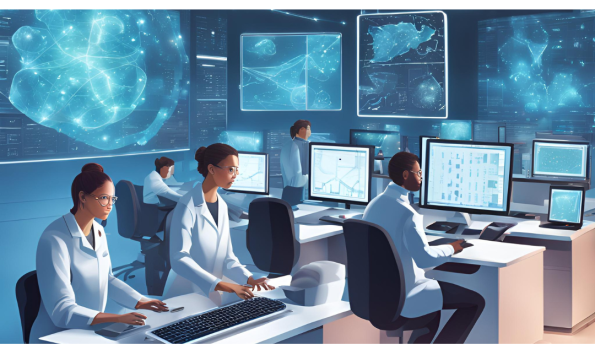

# Machine Learning for Computational Biology

## Instructors

- Dr. Nikolay Oskolkov, Metabolic Research Group Leader, LIOS, Riga, Latvia

## Course overview
The course provides a comprehensive introduction to machine learning techniques in computational biology, focusing on both theoretical knowledge and practical coding skills in R and Python. Participants will learn to implement from scratch and optimize algorithms such as neural networks, random forest, k-means clustering, and Markov Chain Monte Carlo (MCMC), making it an essential resource for advancing research in biostatistics, genetics, and data science. 

## Target audience and assumed background
We assume some basic awareness of UNIX environment, as well as at least beginner level of R and / or Python programming.

## Learning outcomes
By completing this course, you will:

- Understand the basics of statistical and machine learning approaches to biological data analysis
- Gain an overview of basic machine learning algorithms and their applications
- Be able to choose the right algorithms and approaches to answer your specific research question
- Gain confidence in learning new methods needed to answer your research question

---

# Schedule

## Before the course

| Time   | Activity                                                          | Link                                                                                                                                                    |
|--------|-------------------------------------------------------------------|---------------------------------------------------------------------------------------------------------------------------------------------------------|
| ~ 1 h  | In case needed: Recap on Unix                                                                    | [Lab](command-line-basics.md)                                                                                                                           |
| ~ 0.5 h  | R cheatsheet                                                                                   | [Blog](https://iqss.github.io/dss-workshops/R/Rintro/base-r-cheat-sheet.pdf)                                                                                                  |

## Day 1: 9.00 - 13.00 Italy time

| Time           | Activity                                                          | Link                                                                                                                                        |
|----------------|--------------------------------------------------------------------------------------------|---------------------------------------------------------------------------------------------------------------------------------------------|
| 09.00 - 10.30  | Introduction to statistical analysis: Frequentist and Bayesian approaches                  | [Slides](https://github.com/NikolayOskolkov/ML_Computational_Biology/raw/main/slides/ML_CompBiology_AFI_Oskolkov_session1.pdf)                                                                                 |
| 10.30 - 10.45  | Break                                                                                      |                                                                                                                   |
| 10.45 - 11.45  | From statistics to machine learning: linear model and gradient descent                     | [Slides](https://github.com/NikolayOskolkov/ML_Computational_Biology/raw/main/slides/ML_CompBiology_AFI_Oskolkov_session2.pdf)                                                                                                                                                                                                                     |
| 11.45 - 12.00  | Break                                                                                      |                                                                                                                   |
| 12.00 - 13.00  | Practical: comparing univariate and multivariate feature selection methods                 | [Lab](https://html-preview.github.io/?url=https://github.com/NikolayOskolkov/ML_Computational_Biology/blob/main/practicals/Practical1/FeatureSelection.html)                                                                             |

## Day 2: 9.00 - 13.00 Italy time

| Time           | Activity                                                         | Link                                                                                                                                        |
|----------------|--------------------------------------------------------------------------------------------|---------------------------------------------------------------------------------------------------------------------------------------------|
| 09.00 - 10.00  | Lecture: Univariate and multivariate feature selection in R: LASSO and PLS                 | [Slides](https://github.com/NikolayOskolkov/ML_Computational_Biology/raw/main/slides/ML_CompBiology_AFI_Oskolkov_session3.pdf)                                                                                |
| 10.00 - 10.30  | Break                                                                                      |                                                                                                                    |
| 10.30 - 11.30  | Practical: univariate feature selection (differential gene expression analysis)            | [Lab](https://html-preview.github.io/?url=https://github.com/NikolayOskolkov/ML_Computational_Biology/blob/main/practicals/FeatureSelection.html)                                                                             |
| 11.30 - 12.30  | Lunch                                                                                      |                                                                                                                    |
| 12.30 - 14.00  | Practical: multivariate feature selection: comparison between LASSO and PLS                | [Lab](https://html-preview.github.io/?url=https://github.com/NikolayOskolkov/ML_Computational_Biology/blob/main/practicals/FeatureSelection.html)

## Day 3: 9.00 - 13.00 Italy time

| Time           | Activity                                                         | Link                                                                                                                                        |
|----------------|--------------------------------------------------------------------------------------------|---------------------------------------------------------------------------------------------------------------------------------------------|
| 09.00 - 10.00  | Lecture: unsupervised learning, linear dimensionality reduction, PCA and MDS               | [Slides](https://github.com/NikolayOskolkov/ML_Computational_Biology/raw/main/slides/ML_CompBiology_AFI_Oskolkov_session4.pdf)                                                                        |
| 10.00 - 10.30  | Break                                                                                      |                                                                                                                    |
| 10.30 - 11.30  | Lecture: unsupervised learning, non-linear dimension reduction, tSNE, UMAP                 | [Slides](https://github.com/NikolayOskolkov/ML_Computational_Biology/raw/main/slides/ML_CompBiology_AFI_Oskolkov_session4.pdf)                                                                     |
| 11.30 - 12.30  | Lunch                                                                                      |                                                                                                                    |
| 12.30 - 14.00  | Practical: comparing dimensionality reduction techniques on MNIST dataset                  | [Lab](https://html-preview.github.io/?url=https://github.com/NikolayOskolkov/ML_Computational_Biology/blob/main/practicals/DimensionReduction.html)

